# LazyOps - Báo cáo Review Dự Án và Bộ Sơ Đồ

## 1. Phạm vi review

Tài liệu này được dựng sau khi rà các bề mặt chính của dự án:

- `backend`: router, controllers, services, runtime registry, rollout orchestration.
- `agent`: bootstrap app, enrollment, WebSocket control client, dispatcher, runtime service.
- `cli`: `init`, `link`, repo scanner, service detector, generator và writer của `lazyops.yaml`.
- `frontend`: navigation, onboarding, deployments, topology, observability, GitHub integration.

## 2. Kết luận review nhanh

LazyOps là một control-plane đa bề mặt gồm 4 khối chính:

- `Frontend`: giao diện vận hành cho operator.
- `Backend`: trung tâm điều phối, lưu trạng thái, auth, GitHub integration, blueprint, deployment, observability.
- `Agent`: runtime bridge chạy outbound từ target về backend, nhận lệnh triển khai và gửi telemetry.
- `CLI`: công cụ local cho operator để khởi tạo `lazyops.yaml`, link repo, xem logs/traces/status và tunnel.

Ba điểm kiến trúc cần nhấn mạnh trong báo cáo:

1. Repo không giữ SSH, token hay IP triển khai thật; repo chỉ giữ `target_ref` logic trong `lazyops.yaml`.
2. Agent dùng mô hình outbound control channel qua WebSocket, tránh phải mở cổng điều khiển inbound vào server đích.
3. Luồng `standalone` hiện là pipeline rollout rõ ràng nhất; `distributed-mesh` và `distributed-k3s` đã có contract/planning nhưng vẫn ở mức `adapter/composed` nhiều hơn là end-to-end automation hoàn chỉnh.

## 3. Sơ đồ Use Case

Lưu ý: Mermaid chưa có UML use case chuẩn, nên các use case dưới đây được biểu diễn theo kiểu flowchart với các nút hình oval để dễ render trực tiếp trong Markdown.

### 3.1 Use case tổng quát

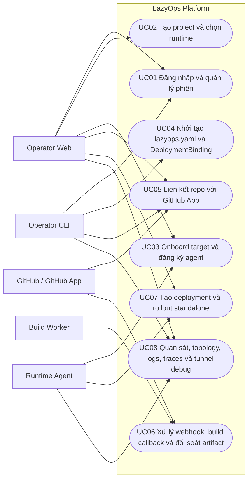

### 3.2 Use case nhóm khởi tạo và tích hợp

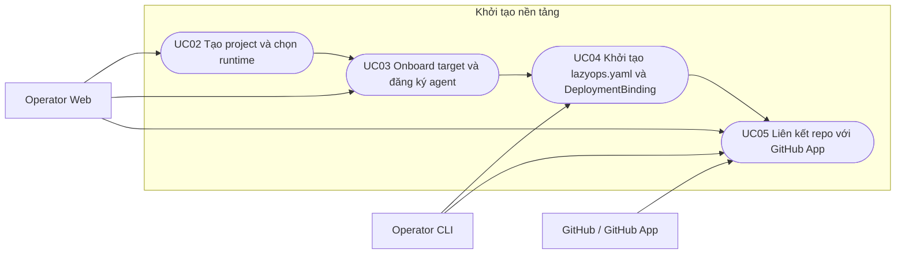

### 3.3 Use case nhóm triển khai và vận hành

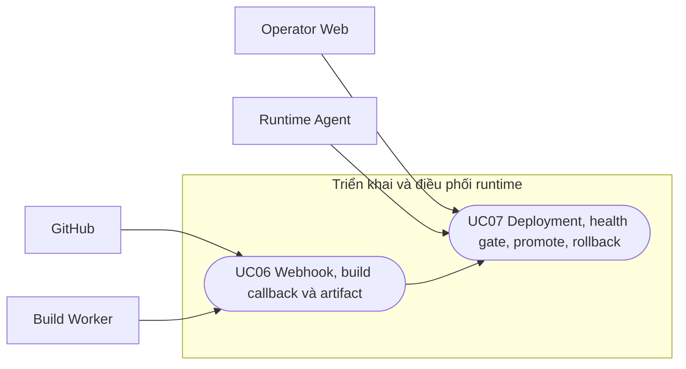

### 3.4 Use case nhóm quan sát và debug

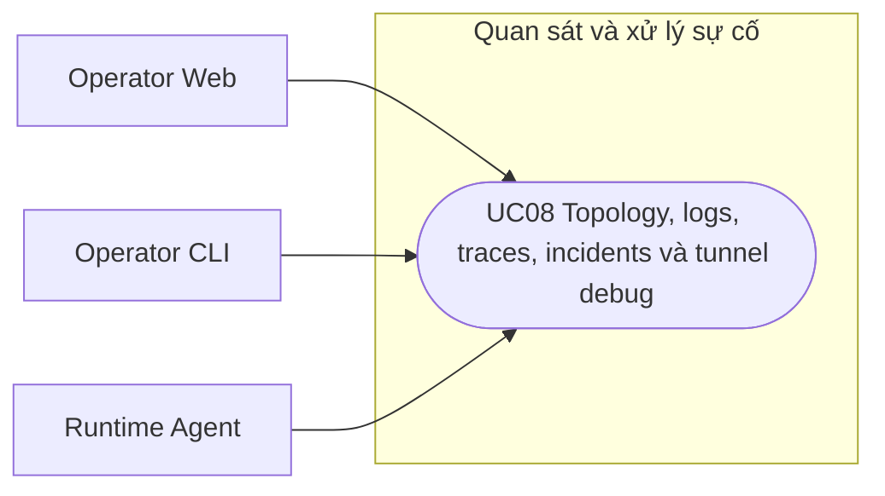

## 4. Giải thích use case chi tiết

### UC01. Đăng nhập và quản lý phiên

Mục tiêu: cho operator truy cập platform bằng web session hoặc PAT cho CLI.

Actor chính: Operator Web, Operator CLI.

Tiền điều kiện: người dùng đã có tài khoản hoặc provider OAuth đã được cấu hình.

Luồng chính:

1. Operator đăng nhập bằng email/password hoặc OAuth.
2. Backend phát hành web session JWT cho frontend hoặc PAT cho CLI qua `cli-login`.
3. Frontend dùng session cookie; CLI lưu PAT vào keychain hoặc local protected file.
4. Các request protected sau đó đi qua middleware xác thực và phân quyền role.

Hậu điều kiện: operator có phiên làm việc hợp lệ để gọi API và WebSocket protected.

Điểm cần chú ý:

- PAT của CLI khác với agent token.
- Agent chỉ dùng `agent token`, không dùng session người dùng.
- Backend phân biệt rõ `web_session`, `cli_pat`, `agent_token`.

### UC02. Tạo project và chọn runtime

Mục tiêu: tạo “đơn vị quản lý” cho ứng dụng trước khi link repo và triển khai.

Actor chính: Operator Web.

Tiền điều kiện: operator đã đăng nhập.

Luồng chính:

1. Operator tạo project trên frontend/backend.
2. Operator chọn hoặc xác nhận runtime mode mục tiêu: `standalone`, `distributed-mesh`, hoặc `distributed-k3s`.
3. Backend lưu project và dùng project này làm owner của bindings, blueprint, revision, deployment và observability.

Hậu điều kiện: project sẵn sàng để gắn target, binding và repo.

Điểm cần chú ý:

- Project là đơn vị trung tâm của gần như toàn bộ state nghiệp vụ.
- Runtime mode ảnh hưởng trực tiếp tới driver rollout và policy compile.

### UC03. Onboard target và đăng ký agent

Mục tiêu: đưa instance/mesh/cluster vào hệ thống và kích hoạt control channel với backend.

Actor chính: Operator Web, Runtime Agent.

Tiền điều kiện: operator đã đăng nhập; biết được target cần đăng ký; với `instance` cần có IP public/private phù hợp.

Luồng chính:

1. Operator tạo target, đặc biệt là `instance` trên backend.
2. Backend sinh bootstrap token ngắn hạn, single-use.
3. Operator chạy agent trên máy đích cùng bootstrap token.
4. Agent gọi `POST /api/v1/agents/enroll`.
5. Backend kiểm tra bootstrap token, quyền sở hữu và IP machine.
6. Backend tạo hoặc tái sử dụng agent record, cấp agent token mới, đánh dấu bootstrap token đã dùng.
7. Agent lưu agent token đã mã hóa trong local state.
8. Agent mở `GET /ws/agents/control`, gửi handshake và tiếp tục heartbeat định kỳ.

Hậu điều kiện: target chuyển sang trạng thái online và sẵn sàng nhận command rollout.

Điểm cần chú ý:

- Không lưu SSH dài hạn trong backend.
- Agent là outbound client, không phải server chờ backend kết nối vào.
- Bootstrap token chỉ là vé vào cửa một lần, sau đó bị vô hiệu hóa.

### UC04. Khởi tạo `lazyops.yaml` và `DeploymentBinding`

Mục tiêu: tạo hợp đồng triển khai logic từ repo local nhưng không để lộ secret hay hạ tầng thật.

Actor chính: Operator CLI.

Tiền điều kiện: đang đứng trong git repo; project và target đã tồn tại.

Luồng chính:

1. Operator chạy `lazyops init`.
2. CLI scan repo root, detect service từ `package.json`, `go.mod`, `requirements.txt`, `Dockerfile`.
3. CLI gọi backend để lấy projects, targets và deployment bindings.
4. CLI chọn hoặc tạo `DeploymentBinding`.
5. CLI generate `lazyops.yaml` chỉ chứa `project_slug`, `runtime_mode`, `deployment_binding.target_ref`, services và policy.
6. CLI kiểm tra payload để chặn secret, token, SSH key, IP raw và backend IDs.
7. CLI ghi file vào repo root nếu operator xác nhận `--write`.

Hậu điều kiện: repo có `lazyops.yaml` hợp lệ ở mức local contract.

Điểm cần chú ý:

- `lazyops.yaml` cố tình chỉ lưu `target_ref` logic.
- Quyền triển khai thật chỉ được resolve ở backend qua `DeploymentBinding`.
- Đây là cơ chế quan trọng nhất để đảm bảo “no-SSH deployment resolution”.

### UC05. Liên kết repo với GitHub App

Mục tiêu: nối project với một repo và branch cụ thể để nhận webhook/build.

Actor chính: Operator Web, Operator CLI, GitHub App.

Tiền điều kiện: project đã tồn tại; `lazyops.yaml` đã có `project_slug` và `target_ref`; GitHub App đã được cài lên repo hoặc org.

Luồng chính:

1. Operator sync các installation của GitHub App.
2. Backend lưu installation scope và repo scope.
3. Operator chọn project, repo và tracked branch.
4. Backend kiểm tra repo có nằm trong installation scope hay không.
5. Backend upsert `ProjectRepoLink`.
6. Sau bước này, GitHub webhook mới có thể map repo/branch sang project trong LazyOps.

Hậu điều kiện: project có repo link và sẵn sàng nhận build events.

Điểm cần chú ý:

- Branch policy được kiểm tra khi nhận webhook.
- Repo link hiện là điểm neo để webhook route vào project.

### UC06. Xử lý webhook, build callback và đối soát artifact

Mục tiêu: biến GitHub event và build result thành build state có thể dùng cho deployment.

Actor chính: GitHub, Build Worker, Backend.

Tiền điều kiện: repo link đã tồn tại; webhook secret đã cấu hình; build worker biết callback về backend.

Luồng chính:

1. GitHub gửi `push` hoặc `pull_request` webhook.
2. Backend verify signature, normalize payload và lookup repo link phù hợp.
3. Backend tạo `BuildJob` ở trạng thái `queued`.
4. Build worker clone/build repo và gọi `POST /api/v1/builds/callback`.
5. Backend kiểm tra `project_id`, `build_job_id`, `commit_sha`.
6. Nếu build thành công, backend cập nhật artifact metadata và tạo revision ở trạng thái `artifact_ready` từ blueprint mới nhất.
7. Nếu build thất bại, backend broadcast event lỗi build cho operator stream.

Hậu điều kiện: build state và artifact metadata được đối soát về control-plane.

Điểm cần chú ý:

- Đây là pipeline build hiện có trong code thật.
- Luồng build -> deployment vẫn là composed; callback build chưa tự tạo deployment end-to-end cho mọi trường hợp.

### UC07. Tạo deployment và rollout standalone

Mục tiêu: tạo deployment record, dispatch command xuống agent, chạy health gate và promote hoặc rollback.

Actor chính: Operator Web, Runtime Agent.

Tiền điều kiện: project có blueprint hợp lệ; target là `instance`; agent online; artifact đã sẵn sàng cho rollout.

Luồng chính:

1. Operator gọi tạo deployment.
2. Backend tạo `DesiredStateRevision` và `Deployment` record.
3. `RolloutExecutionService` kiểm tra artifact, binding và trạng thái agent.
4. `RolloutPlanner` lấy runtime driver phù hợp và sinh kế hoạch rollout.
5. Backend dispatch lần lượt các command xuống agent: prepare workspace, render sidecars, render gateway config, reconcile, start candidate, run health gate, promote.
6. Sau health gate, backend quyết định promote hoặc rollback.
7. Backend phát operator events và ghi incident nếu rollout lỗi.

Hậu điều kiện: deployment ở trạng thái `promoted`, `failed` hoặc `rolled_back`.

Điểm cần chú ý:

- Hiện tại auto-rollout rõ nhất ở `standalone`.
- `distributed-mesh` và `distributed-k3s` đã có contract driver nhưng mức tự động hóa vẫn chưa đồng đều.
- Rollout có sẵn nhánh rollback và garbage collect runtime.

### UC08. Quan sát, topology, logs, traces và tunnel debug

Mục tiêu: giúp operator theo dõi runtime và xử lý sự cố sau triển khai.

Actor chính: Operator Web, Operator CLI, Runtime Agent.

Tiền điều kiện: project đã có runtime data hoặc telemetry; target tương ứng đang online nếu muốn mở tunnel.

Luồng chính:

1. Agent gửi log batches và topology snapshots qua control channel.
2. Backend ingest trace summaries, logs, topology nodes/edges và incidents.
3. Frontend/CLI gọi các API topology, trace, logs preview và correlated observability.
4. Khi cần debug trực tiếp, operator tạo DB/TCP tunnel session qua backend.
5. Backend kiểm tra target online, tránh conflict cổng local và trả session TTL.

Hậu điều kiện: operator có dữ liệu vận hành và đường debug tạm thời để xử lý sự cố.

Điểm cần chú ý:

- Logs và topology hiện là pipeline composed nhưng đã có bề mặt đọc thực.
- Tunnel backend hiện support tốt nhất cho target kiểu `instance`.

## 5. Workflow tổng thể của dự án

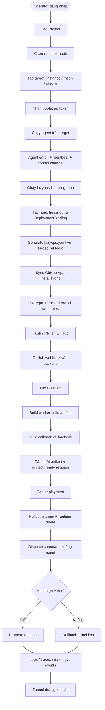

## 6. Pipeline chính của dự án

Pipeline dưới đây là pipeline kỹ thuật quan trọng nhất, nối từ source code tới runtime và quay ngược lại control-plane bằng telemetry:

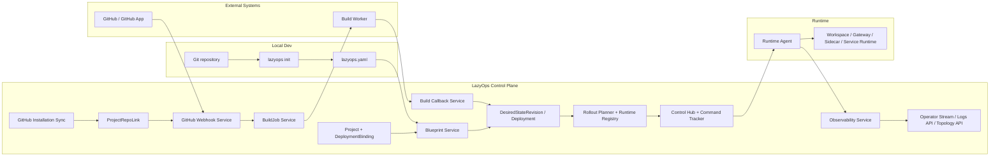

Những ý chính cần ghi trong báo cáo:

- `lazyops.yaml` chỉ là contract logic; `DeploymentBinding` mới là nơi resolve target thật.
- Build worker là external executor; backend giữ vai trò điều phối và đối soát artifact.
- Agent vừa là command executor vừa là nguồn telemetry cho control-plane.
- Pipeline có vòng phản hồi observability sau rollout, không chỉ có chiều build/deploy một chiều.

## 7. Sơ đồ tuần tự cho các chức năng đặc biệt

### 7.1 Sequence - Khởi tạo repo và tạo `lazyops.yaml`

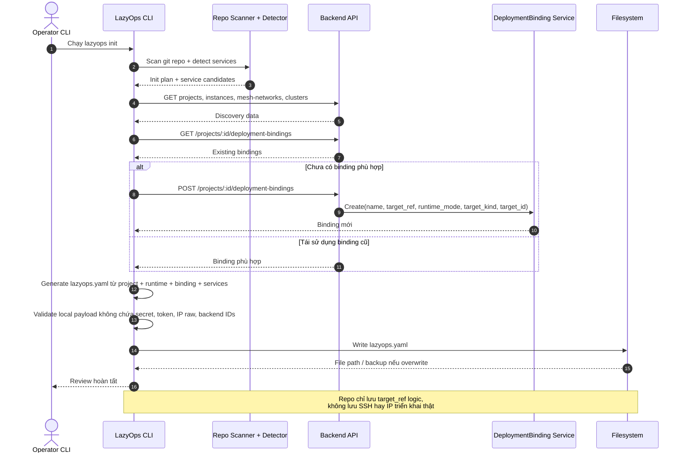

### 7.2 Sequence - Đăng ký agent và mở control channel

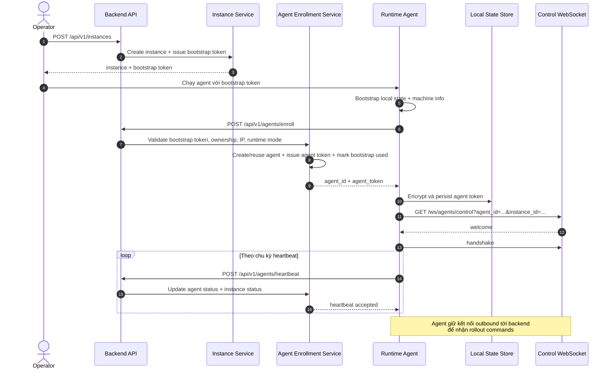

### 7.3 Sequence - GitHub webhook, build job và build callback

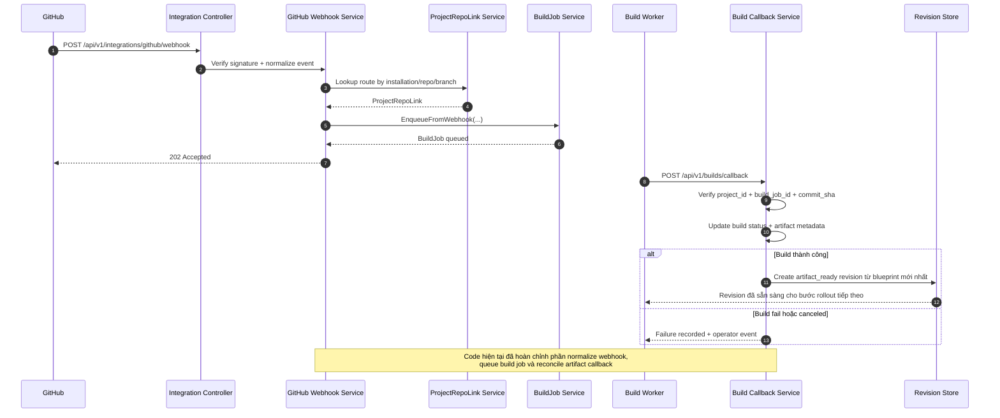

### 7.4 Sequence - Tạo deployment và rollout `standalone`

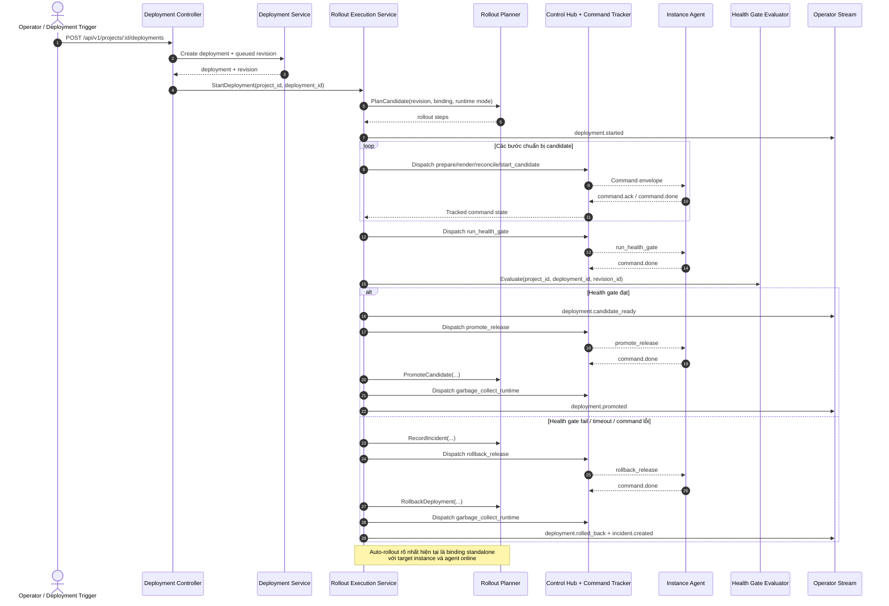

### 7.5 Sequence - Tạo tunnel debug DB/TCP

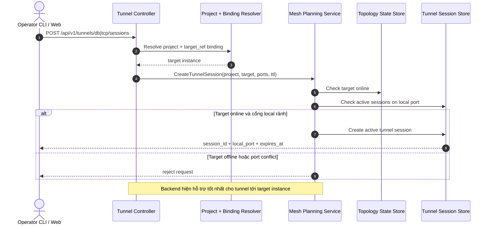

## 8. Gợi ý chèn vào báo cáo viết

Nếu bạn cần đưa vào phần thuyết minh, có thể tóm tắt dự án như sau:

> LazyOps là một nền tảng control-plane cho triển khai ứng dụng đa bề mặt, gồm frontend, backend, runtime agent và CLI. Điểm khác biệt chính của hệ thống là tách biệt hoàn toàn contract trong repo với thông tin hạ tầng thật thông qua `DeploymentBinding` và `target_ref`, đồng thời dùng outbound agent để điều phối rollout, thu telemetry và hỗ trợ debug tunnel mà không cần giữ SSH hoặc mở inbound control port vào máy đích.

> Về mức độ hoàn thiện, pipeline auth, GitHub integration, target onboarding, init contract, build callback, agent enrollment và observability read surfaces đã có code path thực. Riêng luồng rollout `standalone` là tuyến tự động hóa rõ nhất hiện tại; còn `distributed-mesh` và `distributed-k3s` đã có hợp đồng và planning nhưng vẫn đang ở mức composed/adapted hơn là fully automated end-to-end.
