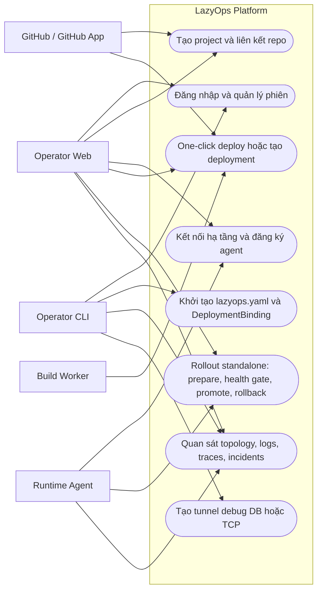
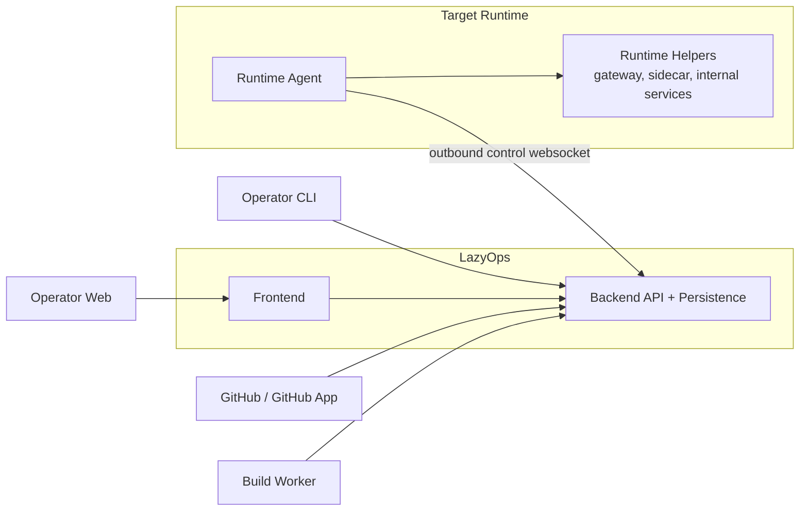
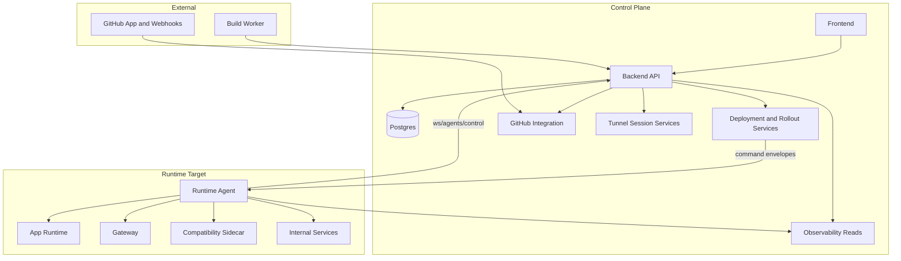
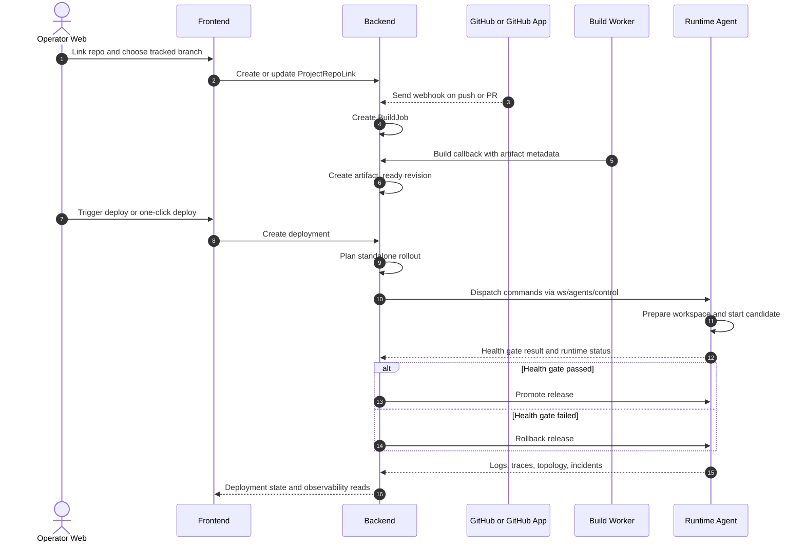
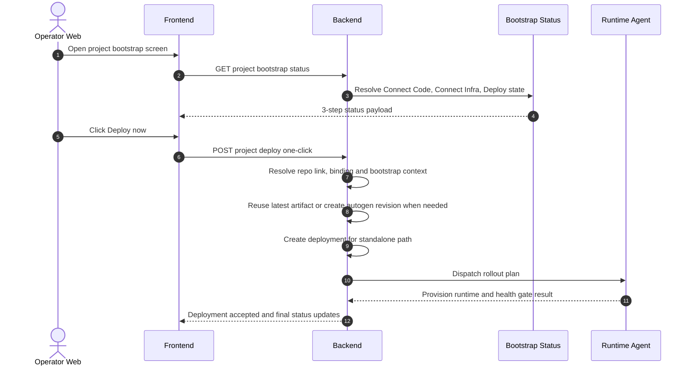
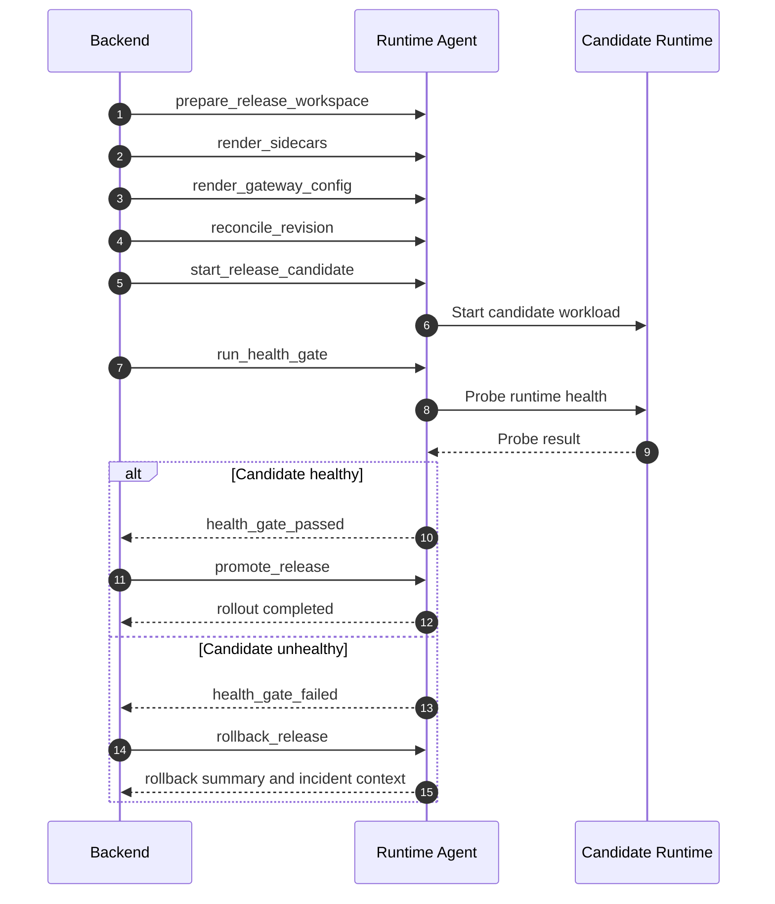
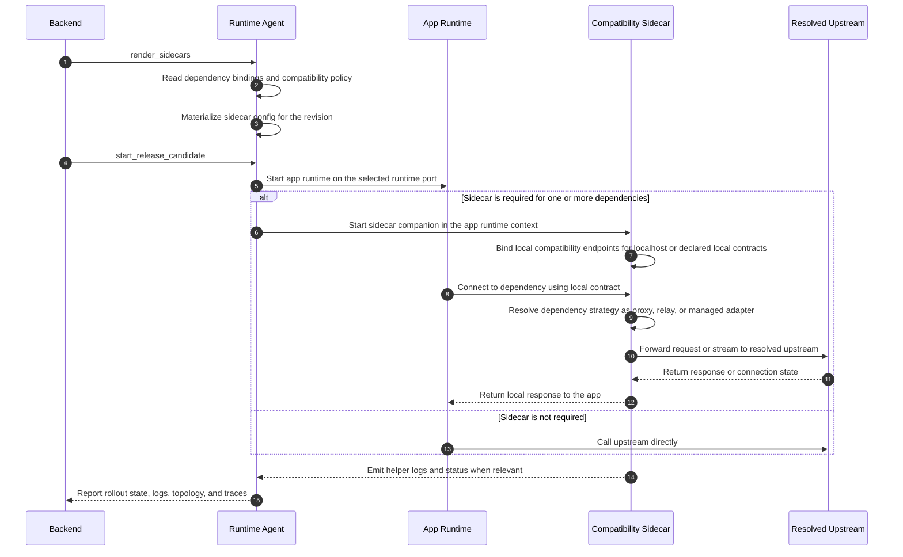
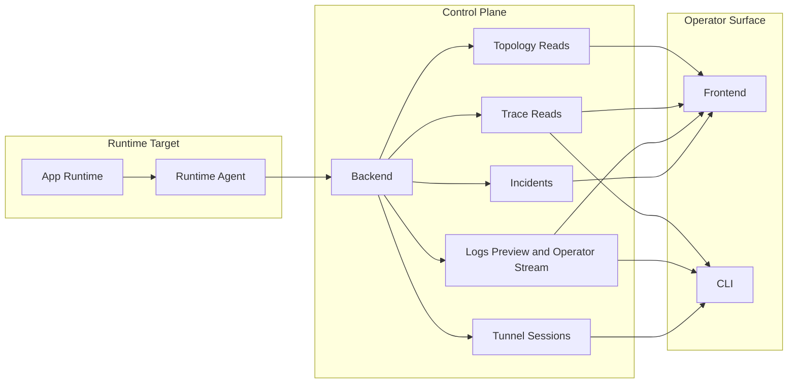
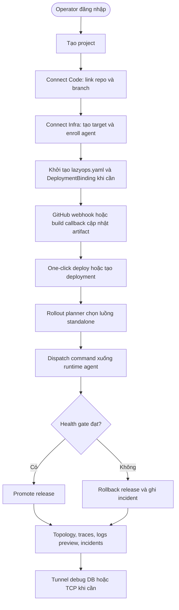

# LazyOps - Bộ Sơ Đồ Báo Cáo Theo Current State

## 1. Mục tiêu tài liệu

Tài liệu này gom các sơ đồ nên dùng khi viết báo cáo hoặc chuẩn bị demo cho LazyOps theo current state của repo.

Phạm vi được dùng làm nguồn sự thật:

- `README.md`
- `docs/index.md`
- `docs/feature-catalog.md`
- `docs/contracts-matrix.md`
- `docs/short-flow-spec.md`

Nguyên tắc trình bày:

- lấy `standalone` làm đường đi chính;
- nhấn mạnh UX 3 bước `Connect Code`, `Connect Infra`, `Deploy`;
- thể hiện rõ outbound agent control WebSocket, GitHub/build callback, rollout standalone, observability và debug tunnels;
- không mô tả `distributed-mesh` hay `distributed-k3s` như runtime end-to-end hoàn chỉnh;
- không claim multi-service monorepo FE+BE trong cùng một project đã deploy end-to-end hoàn chỉnh.

## 2. Kết luận review nhanh

LazyOps hiện là một control plane đa bề mặt gồm bốn khối chính:

- `Frontend`: bề mặt vận hành cho operator;
- `Backend`: trung tâm điều phối, auth, repo link, build callback, revisions, deployments, observability và tunnel sessions;
- `Runtime Agent`: cầu nối runtime chạy outbound từ target về backend;
- `CLI`: công cụ local để sinh `lazyops.yaml`, link repo, đọc status/traces và mở debug tunnels.

Ba điểm nên nhấn mạnh trong báo cáo:

1. Repo chỉ giữ `target_ref` logic trong `lazyops.yaml`, không giữ SSH hay thông tin hạ tầng thật.
2. `Runtime Agent` dùng outbound control WebSocket tới backend, giảm nhu cầu mở cổng điều khiển inbound vào server đích.
3. `standalone` là lát cắt mạnh nhất hiện tại vì đã có rollout plan, dispatch, health gate, promote, rollback và garbage collect; `distributed-mesh` và `distributed-k3s` vẫn nên xem là capability boundary ở mức `adapter/composed`.

## 3. Ghi chú để tránh overclaim khi thuyết trình

Nên nói:

- `standalone` là luồng triển khai chính hiện nay.
- one-click deploy và bootstrap status là lớp UX quan trọng của current state.
- observability hiện gồm topology, traces, logs preview, incidents và operator stream.
- tunnel công khai hiện hỗ trợ `db` và `tcp`.

Không nên nói:

- mesh hoặc k3s đã có auto-rollout end-to-end tương đương standalone;
- observability đã là một platform thống nhất hoàn chỉnh;
- monorepo FE+BE trong cùng một project đã được support end-to-end hoàn toàn.

## 4. Sơ đồ use case tổng quát

```mermaid
flowchart LR
    OW[Operator Web]
    OC[Operator CLI]
    GH[GitHub / GitHub App]
    BW[Build Worker]
    AG[Runtime Agent]

    subgraph SYS[LazyOps Platform]
        UC01([Đăng nhập và quản lý phiên])
        UC02([Tạo project và liên kết repo])
        UC03([Kết nối hạ tầng và đăng ký agent])
        UC04([Khởi tạo lazyops.yaml và DeploymentBinding])
        UC05([One-click deploy hoặc tạo deployment])
        UC06([Rollout standalone: prepare, health gate, promote, rollback])
        UC07([Quan sát topology, logs, traces, incidents])
        UC08([Tạo tunnel debug DB hoặc TCP])
    end

    OW --> UC01
    OW --> UC02
    OW --> UC03
    OW --> UC05
    OW --> UC06
    OW --> UC07

    OC --> UC01
    OC --> UC04
    OC --> UC07
    OC --> UC08

    GH --> UC02
    GH --> UC05

    BW --> UC05

    AG --> UC03
    AG --> UC06
    AG --> UC07
```

Cách thuyết minh ngắn:

- `Operator Web` là actor thao tác phần lớn bootstrap và deploy.
- `Operator CLI` là actor local cho init contract, traces và tunnels.
- `GitHub / GitHub App` và `Build Worker` là external systems cấp đầu vào cho artifact-ready revision.
- `Runtime Agent` là runtime bridge thực thi rollout và phát telemetry.

## 5. Sơ đồ bối cảnh hệ thống

```mermaid
flowchart LR
    OW[Operator Web]
    OC[Operator CLI]
    GH[GitHub / GitHub App]
    BW[Build Worker]

    subgraph LO[LazyOps]
        FE[Frontend]
        BE[Backend API + Persistence]
    end

    subgraph RT[Target Runtime]
        AG[Runtime Agent]
        RH[Runtime Helpers<br/>gateway, sidecar, internal services]
    end

    OW --> FE
    OC --> BE
    FE --> BE
    GH --> BE
    BW --> BE
    AG -->|outbound control websocket| BE
    AG --> RH
```

Điểm cần nói khi dùng sơ đồ này:

- Frontend và CLI đều là bề mặt của operator nhưng không giữ runtime state.
- Backend là control-plane trung tâm.
- Agent luôn là outbound client tới backend.
- `gateway`, `sidecar`, và `internal services` chỉ là runtime helper trong luồng standalone, không phải actor hệ thống độc lập.

## 6. Sơ đồ component hoặc container

```mermaid
flowchart TB
    subgraph CP[Control Plane]
        FE[Frontend]
        API[Backend API]
        DB[(Postgres)]
        OBS[Observability Reads]
        DEP[Deployment and Rollout Services]
        GHINT[GitHub Integration]
        TUN[Tunnel Session Services]
    end

    subgraph EXT[External]
        GHA[GitHub App and Webhooks]
        BLD[Build Worker]
    end

    subgraph RT[Runtime Target]
        AG[Runtime Agent]
        APP[App Runtime]
        GW[Gateway]
        SC[Compatibility Sidecar]
        INT[Internal Services]
    end

    FE --> API
    API --> DB
    API --> OBS
    API --> DEP
    API --> GHINT
    API --> TUN

    GHA --> GHINT
    BLD --> API

    AG -->|ws/agents/control| API
    DEP -->|command envelopes| AG
    AG --> APP
    AG --> GW
    AG --> SC
    AG --> INT
    AG --> OBS
```

Gợi ý diễn giải:

- `Deployment and Rollout Services` là nơi sinh revision, deployment và dispatch kế hoạch.
- `Observability Reads` gom topology, traces, logs preview và incidents.
- `Compatibility Sidecar` chỉ nên được mô tả là runtime helper cho current state của standalone, không nên nâng thành subsystems độc lập trong phần giới thiệu sản phẩm.

## 7. Sequence diagram cho flow chính

Mục tiêu của sơ đồ này là mô tả đường đi tiêu biểu nhất của current state: `repo link -> webhook/build callback -> revision/deployment -> rollout standalone`.

```mermaid
sequenceDiagram
    autonumber
    actor O as Operator Web
    participant FE as Frontend
    participant BE as Backend
    participant GH as GitHub or GitHub App
    participant BW as Build Worker
    participant AG as Runtime Agent

    O->>FE: Link repo and choose tracked branch
    FE->>BE: Create or update ProjectRepoLink
    GH-->>BE: Send webhook on push or PR
    BE->>BE: Create BuildJob
    BW->>BE: Build callback with artifact metadata
    BE->>BE: Create artifact_ready revision
    O->>FE: Trigger deploy or one-click deploy
    FE->>BE: Create deployment
    BE->>BE: Plan standalone rollout
    BE->>AG: Dispatch commands via ws/agents/control
    AG->>AG: Prepare workspace and start candidate
    AG-->>BE: Health gate result and runtime status

    alt Health gate passed
        BE->>AG: Promote release
    else Health gate failed
        BE->>AG: Rollback release
    end

    AG-->>BE: Logs, traces, topology, incidents
    BE-->>FE: Deployment state and observability reads
```

Điểm cần nhấn mạnh:

- `Build Worker` là external executor, backend giữ vai trò đối soát artifact.
- `Runtime Agent` nhận lệnh qua outbound control channel.
- Quyết định promote hoặc rollback xảy ra sau health gate.

## 8. Sequence diagram cho one-click deploy

```mermaid
sequenceDiagram
    autonumber
    actor O as Operator Web
    participant FE as Frontend
    participant BE as Backend
    participant BS as Bootstrap Status
    participant AG as Runtime Agent

    O->>FE: Open project bootstrap screen
    FE->>BE: GET project bootstrap status
    BE->>BS: Resolve Connect Code, Connect Infra, Deploy state
    BS-->>FE: 3-step status payload

    O->>FE: Click Deploy now
    FE->>BE: POST project deploy one-click
    BE->>BE: Resolve repo link, binding and bootstrap context
    BE->>BE: Reuse latest artifact or create autogen revision when needed
    BE->>BE: Create deployment for standalone path
    BE->>AG: Dispatch rollout plan
    AG-->>BE: Provision runtime and health gate result
    BE-->>FE: Deployment accepted and final status updates
```

Cách nói đúng current state:

- One-click deploy là đường UX ngắn nhất cho operator.
- Nó không thay thế các contract backend phía dưới; nó orchestration lại các bước đã có thật, gồm bootstrap status, binding resolution, revision creation và deployment creation.

## 9. Sequence diagram cho health gate, promote và rollback

```mermaid
sequenceDiagram
    autonumber
    participant BE as Backend
    participant AG as Runtime Agent
    participant RT as Candidate Runtime

    BE->>AG: prepare_release_workspace
    BE->>AG: render_sidecars
    BE->>AG: render_gateway_config
    BE->>AG: reconcile_revision
    BE->>AG: start_release_candidate
    AG->>RT: Start candidate workload
    BE->>AG: run_health_gate
    AG->>RT: Probe runtime health
    RT-->>AG: Probe result

    alt Candidate healthy
        AG-->>BE: health_gate_passed
        BE->>AG: promote_release
        AG-->>BE: rollout completed
    else Candidate unhealthy
        AG-->>BE: health_gate_failed
        BE->>AG: rollback_release
        AG-->>BE: rollback summary and incident context
    end
```

Điểm cần nhấn mạnh:

- Đây là lát cắt kỹ thuật phần mềm mạnh nhất của LazyOps hiện tại.
- Health gate, promote và rollback là cơ chế làm cho bài toán triển khai trở nên đáng giá về mặt engineering, không chỉ là gọi `docker run`.

## 10. Sequence diagram cho compatibility sidecar

Sơ đồ này nên dùng khi muốn giải thích vì sao sidecar của LazyOps là một runtime helper đặc biệt, nhưng vẫn không nâng nó thành actor hệ thống độc lập.

```mermaid
sequenceDiagram
    autonumber
    participant BE as Backend
    participant AG as Runtime Agent
    participant APP as App Runtime
    participant SC as Compatibility Sidecar
    participant UP as Resolved Upstream

    BE->>AG: render_sidecars
    AG->>AG: Read dependency bindings and compatibility policy
    AG->>AG: Materialize sidecar config for the revision
    BE->>AG: start_release_candidate
    AG->>APP: Start app runtime on the selected runtime port

    alt Sidecar is required for one or more dependencies
        AG->>SC: Start sidecar companion in the app runtime context
        SC->>SC: Bind local compatibility endpoints for localhost or declared local contracts
        APP->>SC: Connect to dependency using local contract
        SC->>SC: Resolve dependency strategy as proxy, relay, or managed adapter
        SC->>UP: Forward request or stream to resolved upstream
        UP-->>SC: Return response or connection state
        SC-->>APP: Return local response to the app
    else Sidecar is not required
        APP->>UP: Call upstream directly
    end

    SC-->>AG: Emit helper logs and status when relevant
    AG-->>BE: Report rollout state, logs, topology, and traces
```

Điểm cần nhấn mạnh:

- Sidecar chỉ xuất hiện khi dependency bindings và compatibility policy yêu cầu nó.
- Sidecar chạy như companion của app trong runtime context, không phải một service công khai độc lập của control-plane.
- Local contract mà app nhìn thấy có thể là `localhost` hoặc endpoint logic khác, còn sidecar chịu trách nhiệm chuyển tiếp tới upstream thật đã được runtime resolve.
- Nên mô tả sidecar ở mức tổng quát như một lớp `proxy / relay / managed adapter`, không khóa chặt phần thuyết minh vào Postgres.

## 11. Sơ đồ observability và debug

```mermaid
flowchart LR
    subgraph RT[Runtime Target]
        AG[Runtime Agent]
        APP[App Runtime]
    end

    subgraph CP[Control Plane]
        BE[Backend]
        TOP[Topology Reads]
        TRC[Trace Reads]
        LOG[Logs Preview and Operator Stream]
        INC[Incidents]
        TUN[Tunnel Sessions]
    end

    subgraph OP[Operator Surface]
        FE[Frontend]
        CLI[CLI]
    end

    APP --> AG
    AG --> BE
    BE --> TOP
    BE --> TRC
    BE --> LOG
    BE --> INC
    BE --> TUN

    TOP --> FE
    TRC --> FE
    TRC --> CLI
    LOG --> FE
    LOG --> CLI
    INC --> FE
    TUN --> CLI
```

Gợi ý diễn giải:

- Observability hiện là tập hợp nhiều bề mặt đọc có thật: topology, traces, logs preview, incidents và operator stream.
- Debug tunnels là đường riêng cho `db` và `tcp`, nên vẽ cùng nhóm vận hành nhưng tách khỏi observability reads thông thường.

## 12. Workflow tổng thể của current state

```mermaid
flowchart TD
    A([Operator đăng nhập]) --> B[Tạo project]
    B --> C[Connect Code: link repo và branch]
    C --> D[Connect Infra: tạo target và enroll agent]
    D --> E[Khởi tạo lazyops.yaml và DeploymentBinding khi cần]
    E --> F[GitHub webhook hoặc build callback cập nhật artifact]
    F --> G[One-click deploy hoặc tạo deployment]
    G --> H[Rollout planner chọn luồng standalone]
    H --> I[Dispatch command xuống runtime agent]
    I --> J{Health gate đạt?}
    J -->|Có| K[Promote release]
    J -->|Không| L[Rollback release và ghi incident]
    K --> M[Topology, traces, logs preview, incidents]
    L --> M
    M --> N[Tunnel debug DB hoặc TCP khi cần]
```

## 13. Câu chốt nên dùng trong báo cáo

Một cách diễn đạt gọn, đúng current state và khá an toàn khi bảo vệ là:

> LazyOps hiện là một deployment control plane đa bề mặt cho operator. Điểm mạnh nhất của dự án là luồng `standalone`: frontend và CLI giúp operator liên kết code và hạ tầng, backend điều phối build callback, revision, deployment và rollout plan, còn runtime agent giữ kết nối outbound để thực thi rollout, health gate, promote hoặc rollback. Observability và debug cũng đã có bề mặt thật như topology, traces, logs preview, incidents và tunnel sessions. Các chế độ `distributed-mesh` và `distributed-k3s` đã có hợp đồng và capability boundary, nhưng chưa được trình bày như runtime fully automated tương đương standalone.

## 14. Checklist tự soát trước khi nộp báo cáo

- Dùng cùng actor names với `docs/usecase.md`: `Operator Web`, `Operator CLI`, `GitHub / GitHub App`, `Build Worker`, `Runtime Agent`.
- Khi nhắc `standalone`, luôn mô tả là luồng chính hiện tại.
- Khi nhắc mesh hoặc k3s, luôn gắn note `adapter/composed` hoặc capability boundary.
- Không claim monorepo FE+BE cùng project đã deploy end-to-end hoàn chỉnh.
- Nếu nói về tunnel, chỉ nói công khai `db` và `tcp`.
- Nếu nói về observability, dùng đúng vocabulary: topology, traces, logs preview, incidents, operator stream.
